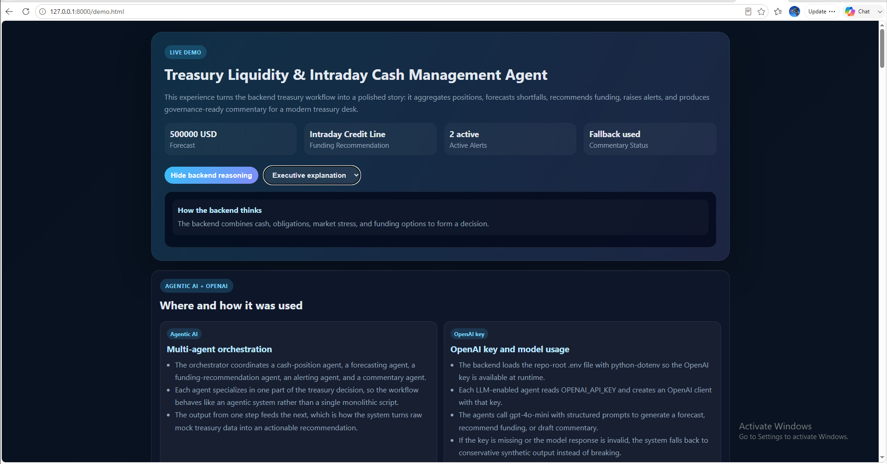
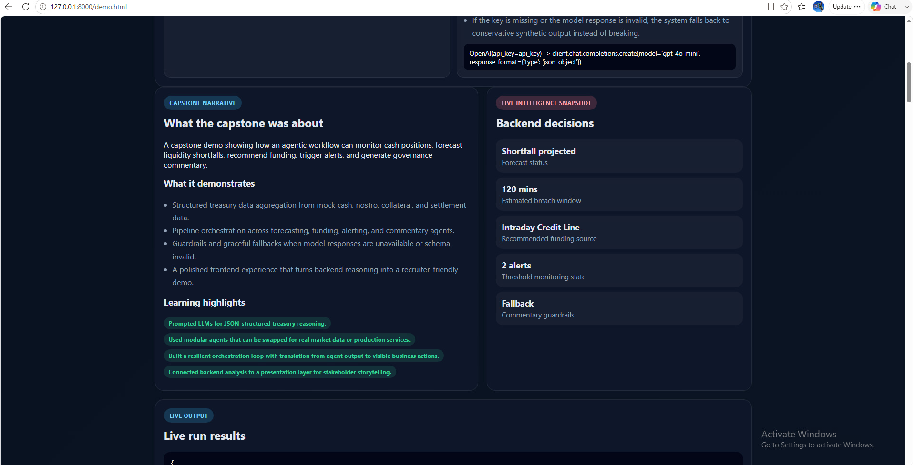
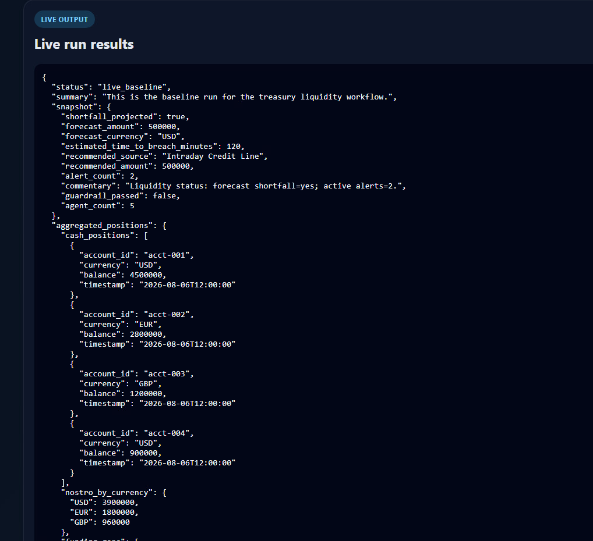

# Treasury, Liquidity & Intraday Cash Management Agent

A time-boxed agentic AI capstone that shows how a treasury desk can turn scattered cash, settlement, and funding signals into a clear, explainable decision workflow.

## Recruiter-Facing Summary

This project demonstrates that I can build an end-to-end agentic AI system around a concrete business problem, not just prototype isolated prompts. It combines a multi-agent orchestration pattern with structured output, tool-grounded recommendations, and a self-verifying guardrail so the final commentary is safe, grounded, and resilient when the model is uncertain.

I built this as a capstone-style deliverable that moved from requirements and specifications to a working browser demo and presentation-ready artifacts. The result is a portfolio piece that shows both product thinking and implementation discipline.

## What This Project Demonstrates

- A 5-agent orchestration flow running from data aggregation to forecasting, funding recommendation, alerting, and commentary generation.
- Structured, JSON-mode output for forecasting and funding decisions instead of free-form reasoning alone.
- Tool-grounded decisioning in which the funding recommendation is constrained to a fixed list of funding sources provided by the system.
- A guardrail that checks AI-written commentary against the underlying structured data before showing it, then falls back to a safe template when needed.
- Graceful degradation design: each agent can fail independently without crashing the entire run, and the orchestrator handles that per-step.
- Stress-scenario simulation for what-if analysis using the same pipeline, clearly labeled as simulated output.
- A spec-first build process that moved from PRD and specifications documents to user stories, acceptance criteria, technical prompts, implementation, and demo delivery.

## Presentation Deck

- Source deck: [Treasury_Liquidity_and_Intraday_Cash_mgmpy_ppt.pdf](Treasury_Liquidity_and_Intraday_Cash_mgmpy_ppt.pdf)
- PowerPoint version: [Treasury_Liquidity_Capstone_Deck.pptx](Treasury_Liquidity_Capstone_Deck.pptx)
- This deck is a concise client-facing walkthrough of the capstone: problem, capabilities, architecture, live demo output, and next steps.

- Slide 1 — Title & Problem: frames the treasury need for faster visibility into liquidity risk before small gaps become urgent issues.
- Slide 2 — What It Does: summarizes monitoring, forecasting, funding recommendation, alerting, commentary, and stress simulation in business terms.
- Slide 3 — How It Works: explains the 5-agent pipeline in plain language and highlights the safe fallback behavior.
- Slide 4 — Live Demo: walks through the actual demo run, including the $500,000 USD shortfall, Intraday Credit Line recommendation, and 2 active alerts.
- Slide 5 — Impact & Next Steps: connects the demo to faster intraday response and outlines realistic next steps for data integration and scenario expansion.

## Live Demo Walkthrough

### 1. Live dashboard view

This view shows the polished demo experience for the live run: a projected shortfall of $500,000 USD, a recommended Intraday Credit Line, and the alert/commentary status for the workflow.

### 2. Backend decisions view

This view highlights the backend decision layer: the system has identified the shortfall, selected a funding action, and surfaced the live alert state for the treasury desk.

### 3. Governance and output view

This view shows the outputs that matter to a reviewer: the live commentary path, the guardrail fallback behavior, and the structured result that the system used to explain the event.

## How It Works (Architecture)

The system is orchestrated by [source_code/orchestrator.py](source_code/orchestrator.py) and runs a five-step pipeline:

- [source_code/cash_position_agent.py](source_code/cash_position_agent.py) aggregates cash positions, funding gaps, collateral movements, and settlement obligations into one structured snapshot.
- [source_code/forecasting_agent.py](source_code/forecasting_agent.py) uses an OpenAI model in JSON mode to forecast near-term liquidity shortfall.
- [source_code/funding_recommendation_agent.py](source_code/funding_recommendation_agent.py) recommends a funding action from a fixed, tool-provided list of sources.
- [source_code/alerting_agent.py](source_code/alerting_agent.py) evaluates threshold breaches using deterministic logic.
- [source_code/commentary_agent.py](source_code/commentary_agent.py) writes governance commentary, and [source_code/guardrails.py](source_code/guardrails.py) verifies the numbers and direction before it is shown.

If the commentary cannot be verified, the system falls back to a safe template summary automatically — a behavior that was triggered in the captured demo run.

## Data & Scope

All data in this project is synthetic and mock-based. The dataset is hardcoded in [source_code/mock_data.py](source_code/mock_data.py) with a fixed timestamp so the demo is reproducible and easy to present.

That scope was a deliberate tradeoff for a time-boxed capstone demo. The architecture itself is not tied to mock data only; the same downstream pipeline could consume a real source under the aggregation layer without changing the rest of the workflow.

## Build Process & Artifacts

This capstone was built in a spec-first sequence:

- [product_requirements_document.md](product_requirements_document.md)
- [specifications_document.md](specifications_document.md)
- [user_stories.md](user_stories.md)
- [acceptance_criteria.md](acceptance_criteria.md)
- [technical_prompts.md](technical_prompts.md)
- [source_code/](source_code/)

The implementation and demo assets are organized around that workflow and include the browser experience in [source_code/demo.html](source_code/demo.html) and the generated demo payload in [source_code/demo_data.json](source_code/demo_data.json).

## What I Learned

Building this project sharpened my understanding of how agentic systems need to be designed for reliability, not just capability. I learned how to structure a multi-agent workflow so each step has a clear job, how to ground tool-based decisions in explicit constraints, and how to add a guardrail that prevents the system from presenting unverified language as if it were factual.

I also learned how much value a small, well-scoped demo can create when the system is resilient by design. The fallback behavior, the per-step error handling, and the scenario simulation all made the workflow feel more realistic and more trustworthy.

## Skills Developed

- Python agent orchestration and workflow design
- OpenAI structured-output and JSON-mode prompting
- Tool-calling with output validation and constraint handling
- Guardrail and self-verification design for AI-generated commentary
- Spec-driven development from PRD through acceptance criteria
- End-to-end demo packaging for a recruiter-facing portfolio presentation

## Tech Stack

- Python
- OpenAI SDK
- python-dotenv
- HTML/CSS/JavaScript for the browser-based demo experience

## Setup / Run Instructions

The exact commands and local setup notes are documented in [source_code/README.md](source_code/README.md). For the browser demo, open [source_code/demo.html](source_code/demo.html) directly or serve the folder locally with Python’s simple HTTP server.

## Closing Statement

This is a time-boxed agentic AI capstone that demonstrates how a multi-agent workflow can move from raw treasury signals to a visible, explainable decision. It is not marketed as a production-ready bank platform, but it does show a strong foundation in orchestration, tool-grounded reasoning, safety design, and portfolio-ready implementation.
